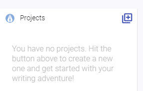
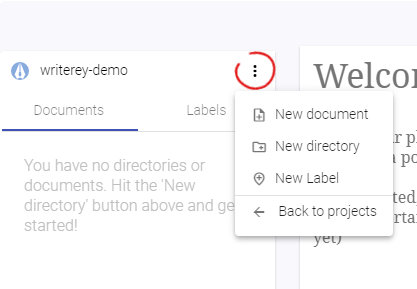

# User Guide

## Projects, Folders and Documents

All your writing projects begin with exactly that: A project. To create one, hit the blue button on the sidebar and give it a fancy name.

Inside a project you can create folders and documents, the hearth of your writing projects. Hit the "More" Menu on the side bar and create them at your liking. To create a folder/document inside another folder, use the menu on the folder.

You'll notice that you can also create a "Label". We will come to that later.

When creating a document, the editor in the middle will become all yours.

## Editor, Autosave and Snapshots

Every time you type something into the editor, it will autosave for you (after a short pause). Do you wonder where your precious ideas go? Don't worry: Right on your disk space, always accessable for you, even without the app. All documents are saved as .html files under `<installation path of writerey>/_writerey_data/<project-name>/` to make sure you can always access your work, no matter the circumstances. Writerey uses CKEditor 5. Most of the handling works just like in any other writing application. If you have doubts or question, the official [CKEditor website](https://ckeditor.com/ckeditor-5/) is probably a good place to look.

On top of that, all 30 minutes - and each time you hit the "Snapshot" Button at the upper right - writerey records a snapshot of all your files and all your projects. It remembers how your files looked like at this moment and saves it. This will enable you to have a look to a previous state of a document whenever you need to.

_Please note: The history function is not implemented yet, but writerey snapshots your files nevertheless. To access these snapshots, you currently need a thirdparty tool to visualize git - for example Github Desktop Client. Please see "troubleshooting and known bugs"_

## Read, Write, Review

Right below the editor, you have three modes to your disposal. Let's have a look on them.

### Read

The Read mode gets all the clunky, distracting stuff out of the way and puts your document into a readonly state. This way, you can check (or simply enjoy) your work without distraction.

_Tip_: To achieve the same for the other modes, hit the distraction free mode button (eye) on the lower left corner.

### Write

You will probably stay in Write Mode most of the time. It lets you edit your document and shows you all the context informations you need to craft your next masterpiece (or homework).

### Review

Did you wonder about the context information I mentioned just now? The review mode is where you add them. Here, you can review your document and add two kinds of information: labels and notes. These information will then show up on Write mode to help you improve your document.

## Labels

Lets discuss Labels first. Labels are here to help you _categorize_ parts of your document.

Does this paragraph belong to chapter 1,2 or 14? Is this paragraph a first draft, the second one or already final? Which scene it belongs to? Which story line? Who's the Point of View character?

You can create labels by clicking the menu on the sidebar. There are two types: numeric and textual ones.

### Numeric labels

Numeric labels consists of a start, end and an interval. Their value are based on these three properties. This is handy when you want to have a label for your scenes and chapters, for example.

### Textual labels

On textual labels you can freely choose your values, i.e. the name of your main characters or some states a paragraph of your work cycles through.

### Assigning labels

After you have created a label and its value, you can assign them.

1. Go back to your document
1. Switch to review mode
1. Click on a paragraph

On the left side, you'll now have your created labels displayed. Choose the values you want to assign to this paragraph. When you now switch back to Write mode and your cursor is inside this paragraph, your labels will show up.

And there is more to them.

## Notes

The second type of context information are notes. Just like sticky notes. You can add them on review mode either on the whole document, or your selected paragraph - or on your labels.

If you add a note to a paragraph, it will only show up on this paragraph. If you have notes that you want on multiple places but not on the complete document, labels are what you're looking for. By putting notes on label values, they'll show up on each paragraph that belongs to this label value.

You're having a ton of background information to that church scene 37 takes place? Label value `37` of label `Scenes` is your friend.

### How to create notes for the document or a paragraph

1. Go to your document
1. Switch to Review mode
1. If you want the note on a paragraph, click on that paragraph and make sure the context of the "New Note" form is set to "Paragraph"
1. Type in whatever you want to note down.
1. Note Type and Colors are two ways to make a note stand out - just try it out. Both are of solely visual effect.
1. Hit the Plus-Button to add your note.

### How to create notes for a label value

Here you have two possibilites. First, you can create a note for a label value if this label value is assigned to your selected paragraph. Then it works like above, you just need to choose a different context.

The second possibility to do so is on the label screen itself.

1. Go to the label screen (Switch the tree on the right with the tab and click on your label)
1. Switch to Review mode
1. Choose your wanted label value as context and write down your note