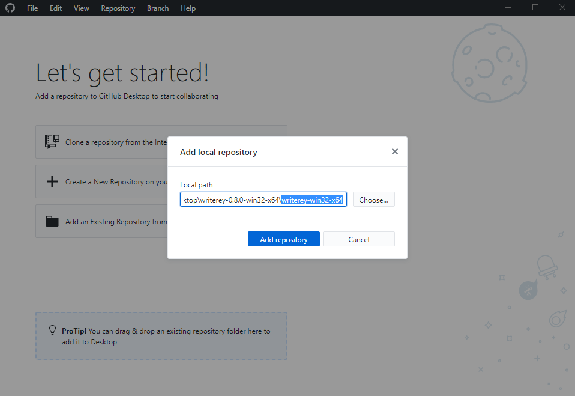
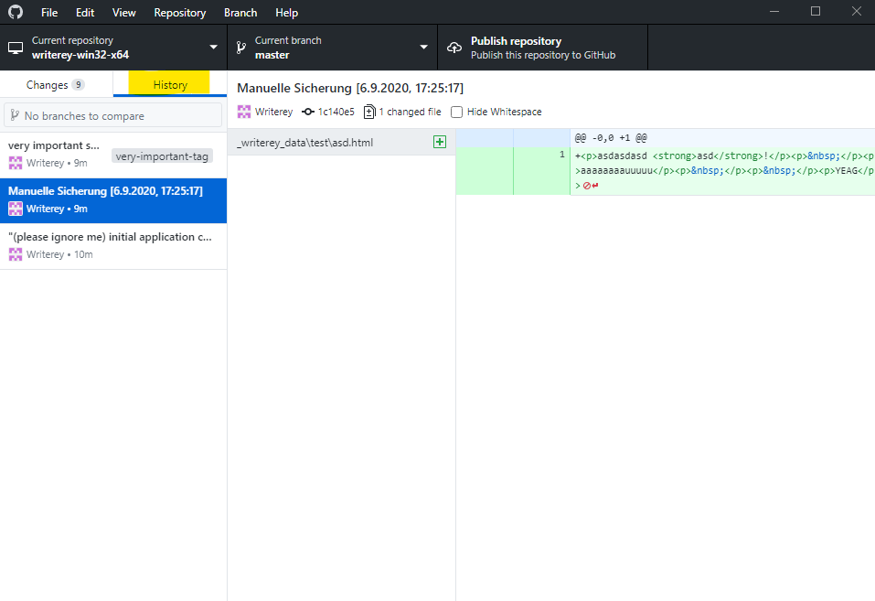

# Troubleshooting and known Bugs

## Images are broken after rename or move

This is a known bug (#94). Your files aren't display anymore, though they are still available under `<installation path of writerey>/_writerey_data/<project-name>/<folder-path>/_writerey_meta/<folder named like the file>`. To get them displayed again you need to add them once again to the file.

The fix for this problem will probably be **not** backward compatible, so if you plan to do image heavy work **better wait until it's fixed**. You can check it's status [here](https://github.com/s-blu/writerey/issues/94).

## There is no history available, how do I access my snapshots?

Since all the snapshot handling is done by git, you can check your snapshots with every git UI client. We recommend using [Github Desktop](https://desktop.github.com/) for this, since it is user friendly and fast to set up.

To see your history in Github Desktop, please proceed like follows

1. Get it [here](https://desktop.github.com/)
1. Run the installer
1. When it asks you for a Github Account, click on "Skip this step" on the bottom
1. On the next screen, hit "Next" without inputing anything
1. Decide if you want to submit usage data and hit "Finish"
1. Open up your file explorer and navigate to your writerey installation path
1. Drag and Drop the folder containing writerey.exe onto Github Desktop
1. A popup appears. Click "Add Repository"

- 

1. Github Desktop now opens up your repository. Click on the tab "History" to access your History.

- 

Done! Here, you can see all the changes writerey recorded for you and copy them into the original file again, if necessary.

## I have some kind of problem that is not listed here!

Feel free to open up an [issue here on Github](https://github.com/s-blu/writerey/issues) that details your problem.
