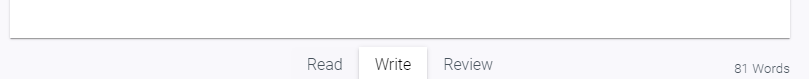
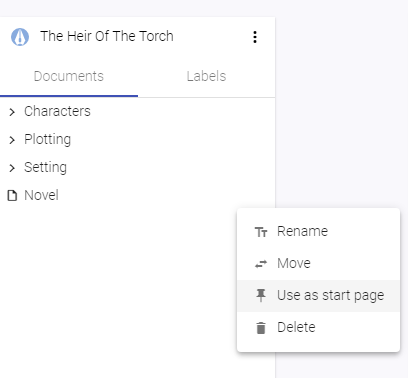

# Application

## Adjust visibility of UI Elements

Writerey wants to give you a place to focus, so it provides you with two possiblities to change what you see in the app. Both possibilites can be used in combination. 

### Distraction Free Toggle

You'll find the distraction free toggle on the lower left corner.

- Click on it to switch through the three states of the distraction free mode
- Full visibility: Everything is displayed, depending on the document mode
- Half visibility: Notes, Label Values and Explorer are tuned down, but become fully visible when you hover the mouse about them
- None visibility: Only the document editor is shown and everything else is hidden, similar to the Read Mode

The distraction free toggle can be changed in and has effect on all views.

### Document Modes

Document Modes also alter the visibility of ui elements.

- Write Mode: Show Context information (Notes and Label Values), if existing
- Review Mode: Show additionally elements to create or edit notes and label values
- Read Mode: Hide all context information and set editor into read only

## What is a "start page"?

Per default, writerey opens the last document you edited when starting up. You can change this behaviour by setting a document as a static start page. This document will then always be opened when starting up writerey.

### Set a start page

- You'll need a document to set it as a  start page. Navigate into the corresponding project.
- In the explorer, hover over the document
- Click on the More Menu on the explorer entry
- Select "Use as start page"

### Remove start page

- Navigate to the document you've currently set as start page
- Click on the More Menu on the explorer entry
- Select "Remove as start page"
