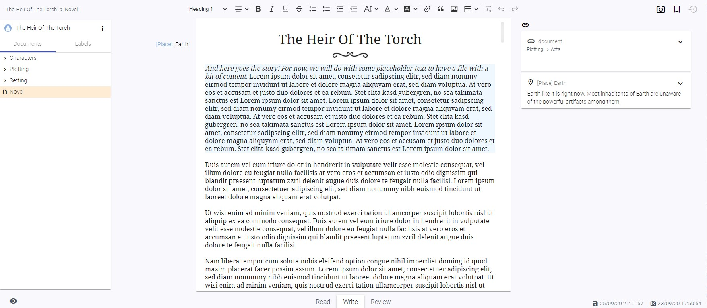

# Documents

## What is a document?

A document is the only type of file writerey knows. It is a text file that will be saved as .html to your local disk space, relative to the installation path of writerey. You'll use documents to write your story, your background informations, plan plots and so on. 

## Create a document

You can create documents only inside of a project.

- Navigate into a project, if you have not already
- Click the "More" Menu on the top right corner of the side bar
- Choose "Create Document"
- Choose a Name and hit "Create"

### Create a document in an existing folder

- Hover over the folder in the sidebar
- Click on the "More" Menu that appears on the tree entry
- Choose "Create Document"
- Choose a Name and hit "Create"

## Rename a document

- In the explorer, hover over the document you want to rename
- Click on the More Menu on the explorer entry
- Select "Rename"
- A dialog appears. Type in the new name for your document.
- Click "Rename"

Your document is now renamed.

_Technical note_: On every rename, writerey creates a snapshot to reflect this change. Don't wonder: If you rename a folder only in a casesensitive way (i.e. "characters" to "Characters") writerey will do two commits to prevent problems. Git on Windows has some problems with case sensitive renames.

## Move a document

- In the explorer, hover over the document you want to move
- Click on the More Menu on the explorer entry
- Select "Move"
- You've now entered the move mode. Hover over folders in your explorer to let the "Move here" arrow appear.
- Click on the arrow on the folder you want to move your document
- If you want to move it to the root, click on the Arrow at the very bottom of the tree, right from the "(To Root)" label

To cancel a move, click on the X beside the document you are just moving.

_Technical note_: On every move, writerey creates a snapshot to reflect this change.

## Delete a document

- In the explorer, hover over the document you want to delete
- Click on the More Menu on the explorer entry
- Select "Delete"
- Confirm the dialog that pops up

_Technical note_: On every delete, writerey creates a snapshot _before_ deleting the document to give you a chance to get it back, if necessary.

## Use the Editor

Writerey uses CKEditor 5. Most of the handling works just like in any other writing application. If you have doubts or question, the official [CKEditor website](https://ckeditor.com/ckeditor-5/) is probably a good place to look.

After creating or navigating a document, you'll get access to the sheet of paper in the middle. Above you'll have a Toolbar that allows to modify how part of your document looks and also give you the possibility to i.e. insert a table.

## Switch document modes

Right below the editor, you have three modes available. When you click on one of these, your document switches mode. Switching document modes affects the visibility of ui elements as well as the state of the editor.

### Read

The Read mode gets all the clunky, distracting stuff out of the way and puts your document into a readonly state. This way, you can check (or simply enjoy) your work without distraction.

_Tip_: To achieve the same for the other modes, hit the distraction free mode button (eye) on the lower left corner.

### Write

You will probably stay in Write Mode most of the time. It lets you edit your document and shows you all the context informations you need.

### Review

In the review mode, you'll see all ui elements you need to add or modify context informations like label values and note items.

## Activate a paragraph

Either click into a paragraph or put the writing cursor into it. After a short moment, a thin blue border will appear on the left side. This paragraph is now active.

You'll now see its label and note informations and be able to edit both for this specific paragraph in the review mode.

## Save a document

Writerey saves automatically for you, every time you do a tiny writing pause. You see that your document got saved when the Save Icon in the lower right corner wiggles and the saved date updates.

## Access documents outside of writerey

Do you wonder where your precious ideas go? Don't worry: Right on your disk space, always accessable for you, even without the app. All documents are saved as .html files under `<installation path of writerey>/_writerey_data/<project-name>/` to make sure you can always access your work, no matter the circumstances.

## Add label values to paragraphs

You'll need a existing label with label values in order to assign them. Please be aware that labels are only valid in project scope, that means every project has its own labels.

1. Open up your document
1. Switch to review mode
1. Activate a paragraph

On the left side, you'll now have your created labels displayed. Choose the values you want to assign to this paragraph. When you now switch back to Write mode and your cursor is inside this paragraph, your labels will show up and - if available - you'll see your label info on the right side.

Adding a label value in review mode:

Seeing a label value in write mode:

## Add label values to documents

Currently, you can only add label values to specific paragraphs. Improvements are planned in the future, please refer to the Roadmap.
