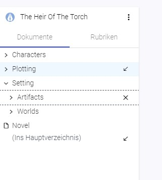

# Folders

## What is a folder?

A folder in writerey is the exact same like a folder on your file system: It is a bag of things that helps you to organize your documents and keep everything clean and tidy. You can also nest folders into each other or work completely without, if you prefer that.

## Create a folder

You can create folders only inside of a project.

- Navigate into a project, if you have not already
- Click the "More" Menu on the top right corner of the side bar
- Choose "Create Folder"
- Choose a Name and hit "Create"

### Create a folder in an existing folder

You can create folders only inside of a project.

- Navigate into a project, if you have not already
- Hover over the folder you want as a parent in the sidebar
- Click on the "More" Menu that appears on the tree entry
- Choose "Create Folder"
- Choose a Name and hit "Create"

## Rename a folder

- Hover over the folder you want to rename in the sidebar
- Click on the "More" Menu that appears on the tree entry
- Choose "Rename"
- Choose a new Name and hit "Rename"

_Technical note_: On every rename, writerey creates a snapshot to reflect this change. Don't wonder: If you do a rename only in a casesensitive way (i.e. "characters" to "Characters") writerey will create two snapshots to prevent problems that can occur on these cases.

## Move a folder

- In the explorer, hover over the folder you want to move
- Click on the More Menu on the explorer entry
- Select "Move"
- You've now entered the move mode. Hover over folders in your explorer to let the "Move here" arrow appear.
- Click on the arrow on the folder you want to move your folder
- If you want to move it to the root, click on the Arrow at the very bottom of the tree, right from the "(To Root)" label

To cancel a move, click on the X beside the folder you are just moving.

_Technical note_: On every move, writerey creates a snapshot to reflect this change.

## Delete a folder

Please be aware that deletion of a folder will also delete all its content, meaning containing folders and documents.

- In the explorer, hover over the folder you want to delete
- Click on the More Menu on the folder entry
- Select "Delete"
- Confirm the dialog that pops up

_Technical note_: On every delete, writerey creates a snapshot _before_ deleting the folder to give you a chance to get it back, if necessary.
