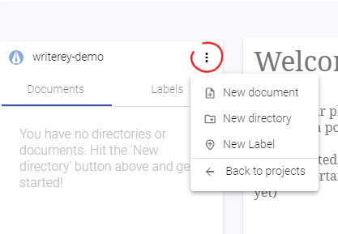

# Folders

## What is a folder?

## Create a folder

You can create folders only inside of a project.

- Navigate into a project, if you have not already
- Click the "More" Menu on the top right corner of the side bar
- Choose "Create Folder"
- Choose a Name and hit "Create"

## Rename a folder

## Move a folder

## Delete a folder
