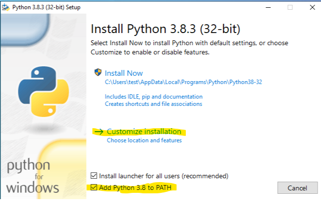
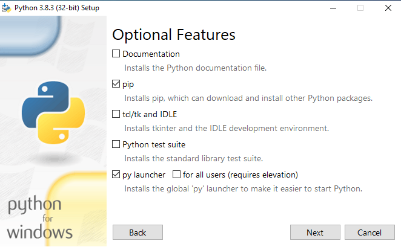
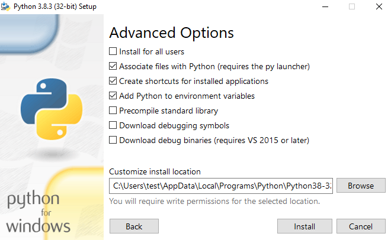
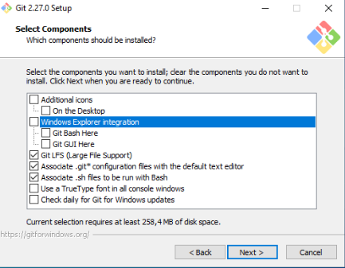
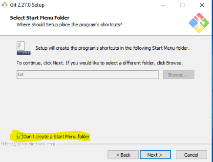
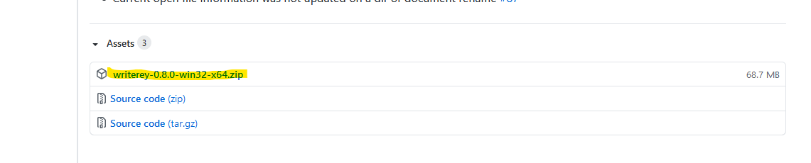

# Installation

Currently, writerey is tested for Windows 8 and 10. Use on other Windows versions could work but are untested.
If you want to use it for another OS, please refer to the development guide to build a fitting executable.

To use writerey, you need following third party software installed:

- Python 3
- Git

## What is Python? Why do I need it?

Python is a popular programming language, just like Java. Do you remember installing and updating Java environments all the time?

Python is already part of Linux and iOS, so you can use it there without installing it separately. On Windows machines, you need to teach Windows to understand it first.

You need it to use writerey because writerey's backend is written in Python. Windows won't be able to run the app without understanding Python.

Do you want to learn more? Visit the [official website](https://www.python.org/) or its [wikipedia page](<https://en.wikipedia.org/wiki/Python_(programming_language)>).

## How do I install Python?

1. Get it here: https://www.python.org/downloads/
2. Run the installer
3. Check “add Python 3.8 to Path”
4. Click on Customize installation

5. Uncheck all but pip and py launcher

6. Choose installation path like you wish and hit Install

7. Click Close to finish python installation

## What is Git? Why do I need it?

Git is a VCS, a Version Control System. A VCS is one of the fundamentals of software development and Git is a fairly popular choice for a VCS (if not _the_ choice). In short, it takes care that developers can jump back to a old version of their code base and that they can have a look what changed between two versions. Developing without a VCS is quite hard to imagine.

In writerey, we use Git to do the exact same for your writing project: To make sure you can always jump back to an old version of your files or to check what you've changed. It archives your first draft, your second, your 23rd one for you so that you don't need to do that manually.

Do you want to learn more? Visit the [official website](https://git-scm.com/) or its [wikipedia page](https://en.wikipedia.org/wiki/Git).

## How do I install Git?

Installing Git can be a bit alienating, since there are a lot of options to choose from. Fear not though, most of the time you can just hit Next.

1. Get it here https://git-scm.com/downloads
2. Run the installer.
3. Accept the GNU License
4. Choose a installation path you want
5. Uncheck “Windows Explorer Integration”, you won’t need it. Leave the rest as is
  - 
6. Check “Don’t create a Start Menu folder”, you won’t need it
  * 
8. Hit Next until you can hit install
9. Hit Install.
10. And hit next – a last time!

## Install writerey

1. If you installed Git or Python, please restart your computer first.
1. Get it here https://github.com/s-blu/writerey/releases/latest - download the .zip under "assets"

1. Unzip the zip in your preffered installation path. Please be aware that all the files you'll create in writerey will lay in the same path
1. Double Click writerey.exe
1. You're ready to go! Visit [our Get Started Guide](../get_started) to start writing!
