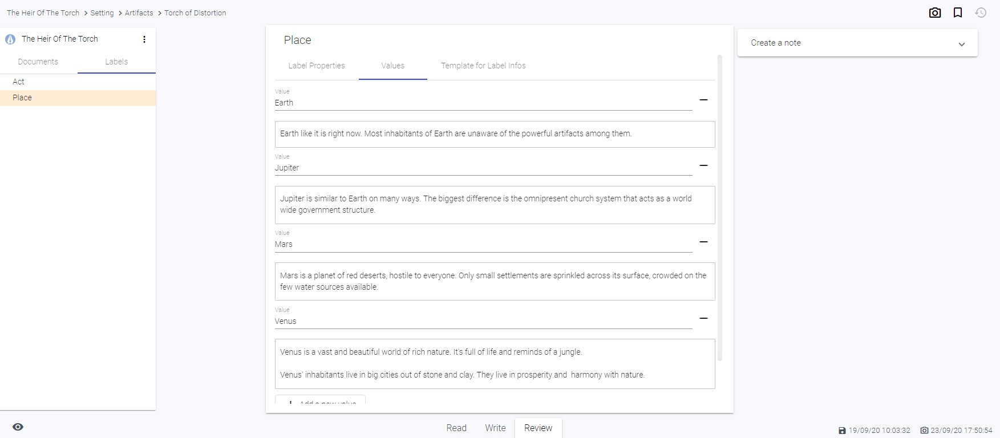

# Labels

## What is a label?

Labels are here to help you _categorize_ parts of your document.

Does this paragraph belong to chapter 1,2 or 14? Is this paragraph a first draft, the second one or already final? Which scene it belongs to? Which story line? Who's the Point of View character?

The label itself is only like a folder for files. To really use them, you need to add values to them. A value consists of two properties: A name and a info (or description). The name is the real value and what you will choose when assigning labels. The info on the other hand will show up as a special kind of note, so this is the right place to add all the important bits that concern this label value.

## Create labels

You can create labels only inside of a project.

- Navigate into a project, if you have not already
- Click the "More" Menu on the top right corner of the side bar
- Choose "Create Label"
- Choose a Name and hit "Create"

## Rename labels

- Switch the tab in the sidebar to "Labels"
- Click on the label you want to rename to open up it's details
- Under tab "details", change the name of the label
- Hit Save

## Delete labels

- Switch the tab in the sidebar to "Labels"
- Hover over the label you want to delete
- Click on the More Menu on the folder entry
- Select "Delete"

- Confirm the dialog that pops up

_Technical note_: On every delete, writerey creates a snapshot _before_ deleting something to give you a chance to get it back, if necessary.

## Save labels

When on a label detail view, you can save your changes by clicking the blue "Save" Button at the bottom of the page.

Alternatively, you can enable automatic saving. Automatic saving on labels works just like it does on documents: If you change anything, no matter in which tab or field, and do a tiny pause, it will save the label.

### Activate autosaving

Autosaving is enabled by default. You can disable it application-wide by clicking the "Autosave is on" text right from the Save Button.

## Create label values

- Navigate into a label definition by choosing it in the tree
- Switch tabs to "Values"
- Scroll down if necessary
- Click on "Add new label value"

## Rename label values

- Navigate into a label definition by choosing it in the tree
- Switch tabs to "Values"
- Scroll to the label value you want to rename
- Input the new name in input field "Value"
- Click Save if autosave is off

## Delete label values

- Navigate into a label definition by choosing it in the tree
- Switch tabs to "Values"
- Scroll to the label value you want to delete
- Click on the - Button right from the name input field
- Confirm the dialog that pops up
- Click Save if autosave is off

Please be aware that this also deletes all the note items that were associated with this label value.

## What is a label info template?

When creating a label and its label values, you'll sometimes find yourself in the situation that you want to maintain similar structured information in your label values descriptions.

For example, maybe you want to note down for each scene you have where it takes place, how long it lasts, who will appear or to which chapter it belongs.

To make it easier for you to maintain such equally structured informations, you can define a label info template. When editing your label values, each label value info will be prefilled with this template - except you already input a info for this label value, of course.

## Create a label value info template

- Navigate into a label definition by choosing it in the tree
- Switch tabs to "Template for Label Infos"
- Input a template
- Click Save if autosave is off

_Attention:_ At the current state, it is necessary to navigate out of the label definition once so that the new template gets applied. Enter another label definition or document and go back to the label definition you've just changed to see your changes reflected in the Values Tab.

## Add or edit a label value info

- Navigate into a label definition by choosing it in the tree
- Switch tabs to "Values"
- Scroll to the label value you want to maintain the label value info for
- Input your label value info in the editor right below the value name
- Click Save if autosave is off

## Delete a label value info

- Navigate into a label definition by choosing it in the tree
- Switch tabs to "Values"
- Scroll to the label value you want to delete the label value info for
- Click into the editor right below the value name
- Delete all its content
- Click Save if autosave is off

_Hint:_ If you've configured a label value info template, your just deleted label value info will be prefilled with this template the next time you navigate into this label definition.
