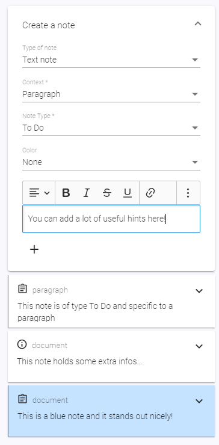
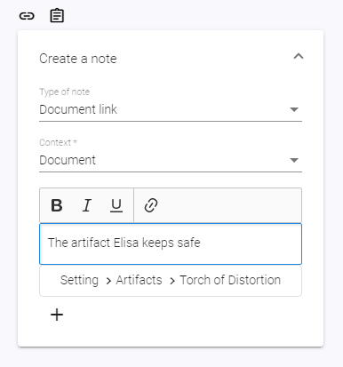
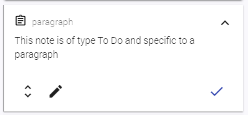

# Note Items

## What is a note?

A Note is a little piece of additional information, just like a sticky note. You can add them on review mode either on the whole document, your selected paragraph or on labels.

If you add a note to a paragraph, it will only show up on this paragraph. If you have notes that you want on multiple places but not on the complete document, labels are what you're looking for. By putting notes on label values, they'll show up on each paragraph that belongs to this label value.

You're having a ton of background information to that church scene 37 takes place? A note on label value `37` of label `Scenes` is your friend.

## What is a document link?

A document link is another type of context information that'll appear on the same place like notes. Just like notes, you can add them to a document, a specific paragraph or a label.

Document links give you the possibility to display another document alongside your active document in your note items. This can be especially useful if you have documents for a specific location or character. With document links, you can add them to the place where you need them and don't need to switch between documents.

Document links will display the document of question in a readonly way.

## Add Notes to a document

You can add notes either to the whole document or to specific paragraphs.
When adding them to documents, you see them all the time (as long as you are in this document).

1. Go to your document
1. Switch to Review mode
1. Double check if the context of the "New Note" form is set to "Document"
1. Type in whatever you want to note down.
1. Note Type and Colors are two ways to make a note stand out - just try it out. Both are of solely visual effect.
1. Hit the Plus-Button to add your note.

## Add Document links to a document

Adding a document link to a document works just like [adding a note to a document](./#add-notes-to-a-document).

## Add Notes to a paragraph

When adding a note to a paragraph, you only see them when this paragraph is active.

1. Switch to Review mode
1. [Active the paragraph](../documents/#activate-a-paragraph) you want to maintain the information for
1. Double check if the context of the "New Note" form is set to "Paragraph"
1. Type in whatever you want to note down.
1. Note Type and Colors are two ways to make a note stand out - just try it out. Both are of solely visual effect.
1. Hit the Plus-Button to add your note.

## Add Document links to a paragraph

Adding a document link to a paragraph works just like [adding a note to a paragraph](./#add-notes-to-a-paragraph).

## Add Notes to a label value

You can add notes to label values in two ways: First, while you are in a document and have a [activated paragraph](../documents/#activate-a-paragraph) that has this label value maintained. Second, you can add notes to all values of a label when having the label details opened.

### Adding notes to a label value while editing a document

Please note that you can only add notes to label values that are maintained on your currently selected paragraph.

1. Switch to Review mode
1. On the form to add a new note, switch context to the desired label value
1. Type in whatever you want to note down.
1. Note Type and Colors are two ways to make a note stand out - just try it out. Both are of solely visual effect.
1. Hit the Plus-Button to add your note.

### Adding notes to a label value while editing a label

1. Choose tab "Labels" in the sidebar
1. Navigate into the label definition by choosing it in the tree
1. On the form to add a new note, switch context to the desired label value
1. Type in whatever you want to note down.
1. Note Type and Colors are two ways to make a note stand out - just try it out. Both are of solely visual effect.
1. Hit the Plus-Button to add your note.

## Add Document links to a label value

This works just like [adding a note](./#add-notes-to-a-label-value).

## Edit a note

Depending to which context the note belongs to, navigate into the corresponding document, label definition or [activate the paragraph](../documents/#activate-a-paragraph).

1. Expand the note if necessary by clicking the Expand-Arrow on the upper right corner
1. Click on the "Edit"-Button on the left lower corner (Pencil Icon)
1. Do you changes
1. Click on the pencil to save your changes

_Hint:_ If you close the note editing by navigating away from the current page, writerey will save a Draft for you to continue editing the next time you enter the edit mode for this note. To abort the editing and discard your changes, click on "Cancel".

_Hint2:_ Label value infos cannot be edited in a document. To do this, please follow the explanation [here](../labels/#add-or-edit-a-label-value-info).

## Edit a document link

Editing a document link is currently not possible. You need to delete it and create a new one.

## Delete or check a note

1. Expand the note if necessary by clicking the Expand-Arrow on the upper right corner
1. Click on the "Check"-Button on the right lower corner

_Attention:_ Contrary to other deletion actions, writerey will not do a safety commit when checking a note.

## Delete or check a document link

That works just like with [notes](./#delete-or-check-a-note).
