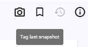

# Snapshots and Tags

## What is a snapshot?

All 30 minutes - and each time you hit the "Snapshot" Button at the upper right - writerey records a snapshot of all your files and all your projects. It remembers how your files looked like at this moment and saves it. This will enable you to have a look to a previous state of a document whenever you need to.

In short: A snapshot freezes your data in space and time and preserves it for you.

## What is a tag?

A tag is a "special name" for a snapshot. Since writerey is automatically doing snapshots in a certain time intervall and on certain actions, you'll gather quite a few snapshots, even without using the manual feature frequently. It can be a bit hard to find a specific state between all these snapshots, for example your first draft, or the second revision, or the state you've send to your professor or agent. 

You can use tags to mark these special milestones to find them more quickly when necessary.

## Create a snapshot

1. Click on the camera icon at the very right, upper corner of the application
1. Input a custom name or confirm the premade one

_Hint:_ Snapshotting always snapshot your _complete data_, application wide. It is not restricted to a certain project. All changes you've done to any data inside writerey will be snapshotted. 

_Hint2:_ Additional to manual snapshots, writerey snapshots your data automatically in a certain time interval (30 minutes) and on certain actions (like deletion or renaming).

## Create a tag

1. Click on the Bookmark icon at the very right, upper corner of the application
1. Input a custom name. Please be aware that you can only use a restricted character set and especially no spaces.

**Attention!** A tag is always created on the _last_ snapshot available. It is **not** automatically generating a new snapshot. That means if you want to tag your current state you first need to do a snapshot and then tag this snapshot. 

## View snapshots and tags

Please note: The history function is not implemented yet, but writerey snapshots your files nevertheless. To access these snapshots, you currently need a thirdparty tool to visualize git - for example Github Desktop Client. Please see ["troubleshooting"](../troubleshooting/#how-do-i-access-my-snapshots).

## Delete a snapshot

Deleting a snapshot is not possible at the moment and will maybe not in future. Snapshots should make sure that you do not lose any data, no matter how old it is or how often you modified the document in the meanwhile.

Deleting snapshots contradicts this.

## Delete a tag

Deleting a tag is not possible right now, but will be implemented in future.
