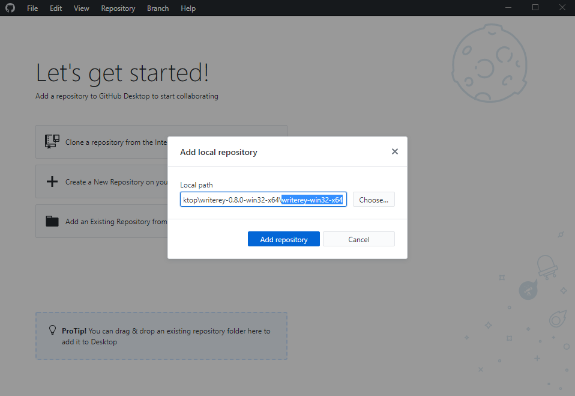
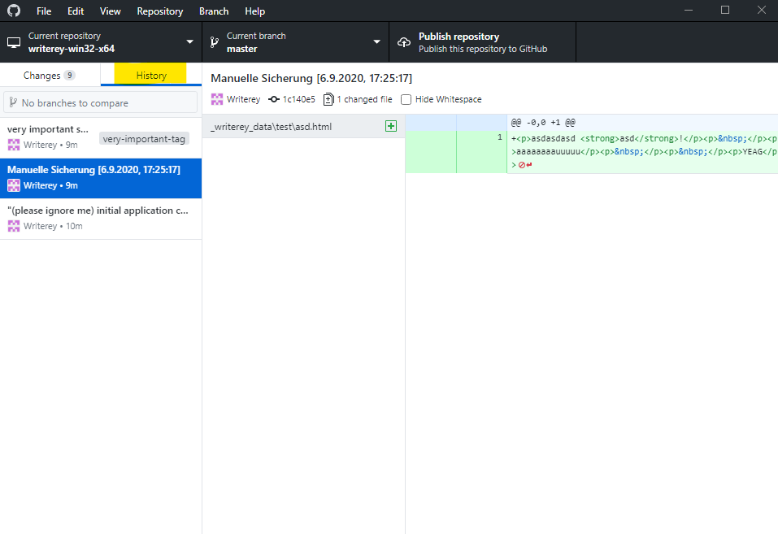

# Troubleshooting

## How do I access my snapshots?

Currently, the history functionality to give you access to your snapshots is not implemented yet. Have a look on the [roadmap](./roadmap.md) to find out when to expect its implementation.

Still, there is a way to access your snapshots.

Since all the snapshot handling is done by git, you can check your snapshots with every git UI client. We recommend using [Github Desktop](https://desktop.github.com/) for this, since it is user friendly and fast to set up.

To see your history in Github Desktop, please proceed like follows

1. Get it [here](https://desktop.github.com/)
1. Run the installer
1. When it asks you for a Github Account, click on "Skip this step" on the bottom
1. On the next screen, hit "Next" without inputing anything
1. Decide if you want to submit usage data and hit "Finish"
1. Open up your file explorer and navigate to your writerey installation path
1. Drag and Drop the folder containing writerey.exe onto Github Desktop
1. A popup appears. Click "Add Repository"

- 

1. Github Desktop now opens up your repository. Click on the tab "History" to access your History.

- 

Done! Here, you can see all the changes writerey recorded for you and copy them into the original file again, if necessary.

## I have some kind of problem that is not listed here!

Feel free to open up an [issue on Github](https://github.com/s-blu/writerey/issues) that details your problem.
